# SHER ·MESSENGER — zero-knowledge encrypted messenger

**Free · open source · MIT licensed · self-hostable in one click.**


A personal, invite-only, end-to-end encrypted chat app — your own private messenger, from scratch — **with an admin panel**.
Real cryptography runs in your browser; the relay is a blind post-office that physically cannot read what it routes.

## One-click deploy

The app also ships an interactive **`/deploy` wizard**: paste your GitHub fork once and it generates real, provider-specific one-click links with no placeholder editing.

> Fork this repo first (button below), then click any target — each one deploys straight from your fork.
> Replace `YOUR_GH_USER/YOUR_REPO` in these links with your fork's path once it's on GitHub.

[](https://github.com/new/import)
[](https://vercel.com/new/clone?repository-url=https://github.com/YOUR_GH_USER/YOUR_REPO&env=SHER_INVITE_ONLY&envDescription=Leave%20SHER_INVITE_ONLY%3D0%20for%20first%20boot%2C%20then%20set%20back%20to%201&project-name=sher-messenger&repository-name=sher-messenger)
[](https://app.netlify.com/start/deploy?repository=https://github.com/YOUR_GH_USER/YOUR_REPO)
[](https://render.com/deploy?repo=https://github.com/YOUR_GH_USER/YOUR_REPO)
[](https://railway.app/new/template?template=https://github.com/YOUR_GH_USER/YOUR_REPO)
[](https://deploy.workers.cloudflare.com/?url=https://github.com/YOUR_GH_USER/YOUR_REPO)
[](https://console.deno.com/new?clone=https://github.com/YOUR_GH_USER/YOUR_REPO)

| Badge | What it needs from you | Free tier |
| --- | --- | --- |
| **Vercel** | one env var: `DATABASE_URL` (Neon, `-pooler` string) | Hobby plan, generous |
| **Netlify** | `netlify.toml` is already committed — just add `DATABASE_URL` after import | 125k function calls/mo |
| **Render** | `render.yaml` blueprint is committed — pick a DB in the dashboard | 750 hrs/mo, sleeps after 15 min idle |
| **Railway** | `railway.json` is committed — add a Postgres plugin or `TURSO_URL` | usage-based free credits |
| **Cloudflare** | `wrangler.toml` + verified OpenNext bundle; memory zero-config, Turso for persistence | 100k req/day |
| **Deno Deploy** | GitHub import auto-detects Next; Turso over HTTP for persistence | 100k req/day-class |

## 📊 Personal Use & Daily Free-Tier Traffic Budget (₹0 Cost)

Daily free-tier capacity and zero-cost traffic allowances across supported cloud providers:

| Platform / Service | Free-Tier Limit | SHER-MESSENGER Usage Pattern | Daily Free Capacity |
| :--- | :--- | :--- | :--- |
| **Cloudflare Pages** | **Unlimited** static requests & bandwidth | React Next.js UI & PWA bundle delivery | **Unlimited Visitors** |
| **Cloudflare Workers** | **100,000 req/day** (10ms CPU limit) | WebSocket upgrade & ephemeral room API endpoints | **~50,000 – 90,000 messages/day** (~2,500 rooms/day) |
| **Cloudflare Durable Objects** | **~13,000 GB-seconds/day** (Free SQLite DO) | WebSocket Hibernation live in-memory relay | **500+ concurrent active rooms** |
| **Cloudflare D1 Database** | **5 GB storage · 100,000 writes/day** | Rate-limiting & admin audit logs (Chat stays in RAM) | **~100,000 room actions/day** |
| **Neon Serverless Postgres** | **0.5 GB storage · 100 compute hrs/mo** | Hard-deleted auto-purged persistence for operator configs | **10,000+ daily queries** |
| **Turso libSQL / SQLite** | **9 GB storage · 500 databases** | Multi-DB replication alternative | **1 Billion row reads/mo** |

> **Summary**: For personal or team use, you can create thousands of ephemeral rooms and exchange messages securely with zero operational cost (₹0) and no paid subscription.

## ⚙️ Analytics & Feedback Configuration (Environment Variables)

Set these in your Cloudflare Dashboard or `.env` file only if you wish to enable analytics or contact forms:

```env
# MeraAnalytics (Optional — leave blank to disable)
NEXT_PUBLIC_MERA_ANALYTICS_SRC="https://your-analytics-domain/mera-analytics.js"
NEXT_PUBLIC_MERA_ANALYTICS_ID="your-website-id-uuid"

# PrismAnalytics (Optional — leave blank to disable)
NEXT_PUBLIC_PRISM_ANALYTICS_ID="pa_your_site_id"
NEXT_PUBLIC_PRISM_ANALYTICS_URL="https://your-prism-worker.workers.dev/api/track"

# Feedback & Contact Form Endpoint (Optional — leave blank to disable)
NEXT_PUBLIC_CONTACT_FORM_ACTION="https://your-form-endpoint.workers.dev/api/submit/endpoint_..."
```

Zero forced tracking, zero telemetry by default — every deployment runs 100% private and open-source.

> 🔒 **Audited WebCrypto Core**: Cryptography is built strictly from native W3C WebCrypto audited browser primitives (AES-256-GCM, PBKDF2-SHA-256 with 250k–750k rounds, ECDH P-256) with zero-knowledge blind relays and verified test suites. See `SECURITY.md` for complete cryptographic proofs.

```mermaid
flowchart LR
  A["Your tab<br/>vault key (PBKDF2 750k)"] -->|"X3DH-lite"| B["Double Ratchet<br/>per-message key"]
  B -->|"AES-256-GCM<br/>header = AAD"| C["sealed blob<br/>v1.iv.ciphertext"]
  C -->|TLS| D["Relay — BLIND<br/>routes ciphertext only"]
  D --> E[(Neon / Turso /<br/>D1 / SQLite / memory)]
  D --> F[(R2 / B2<br/>attachment blobs)]
  D -->|TLS| G["Peer tab<br/>decrypts, key destroyed"]
  style D fill:#1a1f2b,stroke:#4ff0b6
  style A fill:#0f1419,stroke:#6aa6ff
  style G fill:#0f1419,stroke:#6aa6ff
```



## Live documentation

| Route | What it is |
| --- | --- |
| `/` | the messenger |
| `/guide` | **how to use it + full deploy guide (Vercel / Netlify / Cloudflare / VPS-Docker)** |
| `/plan` | PRD, crypto spec, wire format, threat model, API reference |
| `/admin` | admin console (invites, users, broadcast, audit) — not publicly linked, requires env gate + bearer (see below) |
| `/privacy` | privacy policy (matches the *actual* data-flow, no false claims) |
| `/terms` | terms of use |
| `/api/health` `/api/ked/healthz` `/api/ked/readyz` `/api/ked/version` | ops probes |
| `/api/dev-selftest?relay=1` | 51-check conformance suite, live |

### Public web, direct admin portal & dual-language support

The web app is **public and dual-language (English / हिन्दी)** — anyone can open `/` and use **free 30m ephemeral rooms without any login**. `/admin` is **never linked** publicly from the UI and provides a streamlined 1-step login using `ADMIN_EMAIL` and `ADMIN_PASSWORD`:

1. **Direct Admin Login** — Enter `ADMIN_EMAIL` + `ADMIN_PASSWORD` directly at `/admin`. The backend authenticates via timing-safe comparison against environment variables and issues an authentic session token immediately without requiring manual token copy/paste.
2. **Active Rooms Monitor & Shredder** — Live tab in `/admin` allowing the operator to inspect all active ephemeral rooms, creation time, participant count, remaining TTL, and trigger instant "Terminate & Burn" destruction.
3. **Pure Dual Language** — All interfaces provide pure, idiomatic English and Hindi (हिन्दी) translations with instant switching.

### Free 30m rooms — zero login required (बिना लॉगिन) · ephemeral, auto-burn

Anyone can create an instant group room and share a 6-character code — **no account, no handle, no passphrase, 100% FREE without login**.
- Private keys and session keys exist purely in browser memory.
- Closing the tab destroys all in-memory keys instantly.
- Messages auto-shred on the relay after TTL (customizable from 5m to 60m, defaulting to 30m).
- Anti-screenshot screen blur triggers whenever the browser window loses focus.

**How `anonId` works:** the client generates `anonId = anon_<12 hex>` (e.g. `anon_a1b2c3d4e5f6`) in memory / `sessionStorage` only — never stored in `ked_users`, never persisted to `localStorage`, never tied to a handle. It is sent as `anonId` in `rooms/code`, `rooms/join`, `send`, `sync` and is used as `userId`/`senderId`/`createdBy` for that ephemeral session. Close the tab → `anonId` + local history gone. If a Bearer token is present, auth wins and `anonId` is ignored.

```bash
# FREE — no bearer, no login (create a 5-person room, 30m TTL)
curl -H "content-type: application/json" \
  -d '{"anonId":"anon_abc123def456","maxUsers":5,"ttlMs":1800000}' \
  localhost:3000/api/ked/rooms/code
# → {"ok":true,"roomId":"r_…","code":"a1b2c3","maxUsers":5,"expiresAt":"…"}
# join as guest (no login):
curl -H "content-type: application/json" \
  -d '{"code":"a1b2c3","anonId":"anon_xyz987uvw654"}' \
  localhost:3000/api/ked/rooms/join
# send + sync also accept anonId fallback (no bearer):
curl -H "content-type: application/json" \
  -d '{"roomId":"r_…","header":"…","body":"iv.ct","anonId":"anon_abc123def456"}' \
  localhost:3000/api/ked/send
curl "localhost:3000/api/ked/sync?cursor=0&anonId=anon_abc123def456"
# If you ARE logged in, just send Bearer as before — anonId is ignored when auth succeeds.
# curl -H "authorization: Bearer $TOKEN" -d '{"maxUsers":5}' localhost:3000/api/ked/rooms/code  # also works
```

- `POST /api/ked/rooms/code` (`src/app/api/ked/[...slug]/route.ts:278`) — **no auth required**; accepts `{anonId, maxUsers 2-30, ttlMs 1-30m}` (hard cap **30m**). If `Authorization: Bearer` is present the logged-in user is used; otherwise `anonId` (client-generated `anon_xxx`, or auto-generated server-side `anon_<12>`) becomes `userId`/`createdBy`. Creates `group` room with `defaultTtl=ttlMs`, mints 6-char code → `ked_room_codes` (`SHA-256(code)`), `uses=1`, `expiresAt=now+ttlMs`. Rate-limited via `rooms` bucket.
- `POST /api/ked/rooms/join` (`src/app/api/ked/[...slug]/route.ts:303`) — **no auth required**; `{code, anonId}` → `consumeRoomCode(SHA(code), userId)` checks `revoked/expired/uses<maxUsers/members<maxUsers`, then `joinRoom`. Idempotent if already member.
- `POST /api/ked/send` (`src/app/api/ked/[...slug]/route.ts:322`) and `GET /api/ked/sync` (`src/app/api/ked/[...slug]/route.ts:778`) — also accept `anonId` fallback so anon members can chat without ever creating a `ked_users` row.

Creator = first member; sharing the code = entering. Rooms auto-burn after `ttlMs` and auto-delete on browser close (see 30m auto-burn below). For **persistent** DM/group rooms with contacts, history, and E2EE Double Ratchet, an account (handle+passphrase) is still required — anon rooms are ephemeral-only, 30m max. ER + flow details: `ARCHITECTURE.md`.

### 30m auto-burn ephemerals

Code-rooms use `defaultTtl <= 30m` (enforced server-side: `Math.min(ttl, 30*60_000)` in `route.ts:285`). After 30m:

- **Server:** `store.shredExpired()` (called on every `/sync`) nulls `body` / `destroyedAt = now` for expired messages and attachments. History becomes tombstones.
- **Client:** `burnDue()` in `src/lib/client.ts` runs every **700 ms**, and the server sweep runs every `GET /sync`. Expired local `HistMsg` entries are zeroed (`text=""`, `attachment=null`, `destroyed=true`).

After the window, **history is dead on both sides** — no recovery, by design. See `ARCHITECTURE.md` > Ephemeral rooms & 30m auto-burn and `DATA-RETENTION.md`.

### Auto-delete on browser close & screenshot friction

- `src/app/page.tsx` registers `beforeunload` → `sessionStorage.clear()` (wipes `ked.resume.v1` tab key + `ked.admin.env`) and clears ephemeral local history for rooms with `ttl <= 30m`. Watermark + blur logic (`globals.css` + `secret` class) reinforces that next open requires the passphrase.
- Screenshot/download friction (`globals.css` `.no-screenshot`, `.watermark` repeating-linear-gradient, `contextmenu`/`copy` block, `PrintScreen`/`Ctrl+P`/`Ctrl+Shift+S` intercept with toast, blur while unfocused via `secret`/`hidden` state). The ledger records `integrity.violation` / `message.burned` events. **OS-level screenshots cannot be blocked 100%** — this is friction + watermark + blur-after-download, not a guarantee. See `THREAT-MODEL.md` and `PRIVACY_POLICY.md`.

## Feature matrix

| Phase | Shipped |
| --- | --- |
| **P1 core** | invite-only signup · handle + passphrase identity (no phone/email) · E2EE 1:1 text · X3DH-lite + Double Ratchet · sent/sealed/read ticks · typing · reply · edit ("edited" state) · delete-for-everyone (relay shred) · reactions · day separators · offline outbox (IndexedDB) · safety number (60-digit) + verify flag · encrypted key export · panic wipe |
| **P1.5 admin** | `/admin` with RBAC · dashboard counters · user list with block/unblock/promote/purge · invite manager (hashed codes, use-limit, expiry, role) · SYSTEM broadcast (flagged "not E2EE") · content-free audit trail · health/ready/version probes |
| **P2 rich** | attachments (client-side AES-GCM, SHA-256 verified, ≤2 MB) · sender-key groups ≤32 with re-key · per-room + per-message TTL (30s → 30d) · local-only history search · PWA install · offline shell · blur-on-blur · clipboard auto-clear |
| **P3 later** | voice/video (LiveKit), multi-device QR link, stories, federation note |

## Quickstart

```bash
cp .env.example .env       # empty ⇒ volatile in-memory relay, perfect for a first look
npm ci
npx drizzle-kit push       # optional; the app also self-creates tables on first boot
npm run build && npm start
# open http://localhost:3000
```

### First admin + first invite

```bash
# 1. allow open bootstrap for 30 seconds and create your identity in the UI
SHER_INVITE_ONLY=0 npm start        # register your handle in the app, then Ctrl-C

# 2. mint an admin invite via the API using that account's token
curl -s localhost:3000/api/ked/admin/invites \
  -H "authorization: Bearer $TOKEN" -H "content-type: application/json" \
  -d '{"create":true,"role":"admin","maxUses":3,"expiresInDays":30,"label":"bootstrap"}'
# → {"ok":true,"code":"<32 hex chars>",...}   # shown ONCE, stored hashed

# 3. turn the gate back on and hand out https://your-host/?invite=<code>
SHER_INVITE_ONLY=1 npm start
```

## Deploy (one command each)

| Target | Build | Deploy | Notes |
| --- | --- | --- | --- |
| **Vercel** | `vercel --prod` (framework auto) | one-click badge or `vercel --prod` | add `DATABASE_URL` (Neon). Use Neon's `-pooler` string. Set `ADMIN_EMAIL` + `ADMIN_PASSWORD` as Env Secrets if you want `/admin`. |
| **Netlify** | `netlify deploy --build --prod` | same command | `netlify.toml` + Next runtime committed; add `ADMIN_EMAIL`/`ADMIN_PASSWORD` in Site → Env |
| **Cloudflare** | `npx opennextjs-cloudflare build` | `npx wrangler deploy --env=""` | OpenNext build + Wrangler verified; memory demo, Turso persistence. In Cloudflare dashboard set **Build:** `npx opennextjs-cloudflare build`, **Deploy:** `npx wrangler deploy --env=""`, **Version:** `echo "skip"` *or* `npx wrangler deploy --env=""` depending on whether the UI shows Build/Deploy or Build/Version. Secrets: `npx wrangler secret put ADMIN_EMAIL` + `ADMIN_PASSWORD` + `TURSO_TOKEN`. |
| **Deno Deploy** | click the badge or import the GitHub fork | auto | Next auto-detection + Turso over HTTP |
| **Render** | click the badge above, or `render blueprint launch` | auto | `render.yaml` blueprint committed; add `ADMIN_EMAIL`/`ADMIN_PASSWORD` as Secrets |
| **Railway** | click the badge above, or `railway up` | auto | `railway.json` committed |
| **VPS / Docker** | `docker compose up -d --build` | `docker compose logs -f ked` | `SHER_SQLITE_PATH=/data/sher-messenger.db` |

Full step-by-step with screenshots-level detail: **`/guide` §8–12**, or [`RUNBOOK.md`](./RUNBOOK.md). For production verify checks after deploy, see `RUNBOOK.md` § Production verify.

## Tech stack

| Layer | Choice | Why |
| --- | --- | --- |
| Crypto | WebCrypto: ECDH+ECDSA P-256, AES-256-GCM, HKDF-SHA-256, PBKDF2 750k | universally available, FIPS-validated implementations, zero bundled crypto code |
| Ratchet | X3DH-lite + Double Ratchet (own impl, spec-faithful) | forward secrecy + post-compromise security, auditable in the UI |
| Framework | Next.js 16 (App Router) + React 19 + TS strict | one codebase for static shell + relay routes |
| UI | Tailwind 4, hand-built components | no component library fetching remote JS |
| DB | Drizzle schema + 4 adapters (Postgres / libSQL / node:sqlite / memory) | swap by env var, no client change |
| Storage | relay-blob today, R2/B2 adapter interface for attachments | ciphertext only, never a filename |
| Realtime | cursor polling (1.6s) + SSE-ready adapter shape | works on every free tier; WS notes in ARCHITECTURE.md |

## Repository map

```
src/lib/primitives.ts    WebCrypto core (base64, HKDF, AEAD, KDF, fingerprints)
src/lib/protocol.ts      X3DH-lite, Double Ratchet, sender-key groups, attachments
src/lib/client.ts        vault, sessions, sync loop, outbox, ledger
src/lib/outbox.ts        IndexedDB offline queue (ciphertext only)
src/lib/sentry.ts        second real identity for a live self-test
src/server/store.ts      one Store interface, 4 backends
src/app/api/ked/[slug]   the relay router (never-HTML guarantee)
src/app/(admin|guide|plan|privacy|terms)  UI surfaces
docs/                    ARCHITECTURE · THREAT-MODEL · RUNBOOK · RETENTION · INCIDENT
```

## Docs pack

[README](./README.md) · [ARCHITECTURE](./ARCHITECTURE.md) · [THREAT-MODEL](./THREAT-MODEL.md) ·
[SECURITY](./SECURITY.md) · [PRIVACY](./PRIVACY_POLICY.md) · [TERMS](./TERMS.md) ·
[DATA-RETENTION](./DATA-RETENTION.md) · [INCIDENT-RESPONSE](./INCIDENT-RESPONSE.md) ·
[RUNBOOK](./RUNBOOK.md) · [SECURITY-HEADERS](./SECURITY-HEADERS.md) · [CONTRIBUTING](./CONTRIBUTING.md) ·
[CHANGELOG](./CHANGELOG.md) · [LICENSE](../LICENSE) · [.env.example](../.env.example)

> All links above are `docs/`-relative (e.g. `docs/ARCHITECTURE.md` from repo root, `./ARCHITECTURE.md` from `docs/README.md`).

## Reliability contract

Every `/api/ked/*` response is JSON — never an HTML error page — even if something throws deep inside a
handler. Prove it: `curl -s localhost:3000/api/ked/__crash-test` → HTTP 500 with a JSON body.

## Development

```bash
npm run lint && npx tsc --noEmit && npm run build
curl -s "localhost:3000/api/dev-selftest?relay=1" | jq '.passed, .total'
```

