# SHER ·MESSENGER — zero-knowledge encrypted messenger

**Free · open source · MIT licensed · self-hostable in one click.**


A personal, invite-only, end-to-end encrypted chat app — your own private messenger, from scratch — **with an admin panel**.
Real cryptography runs in your browser; the relay is a blind post-office that physically cannot read what it routes.

## One-click deploy

The app also ships an interactive **`/deploy` wizard**: paste your GitHub fork once and it generates real, provider-specific one-click links with no placeholder editing.

> Fork this repo first (button below), then click any target — each one deploys straight from your fork.
> Replace `YOUR_GH_USER/YOUR_REPO` in these links with your fork's path once it's on GitHub.

[](https://github.com/new/import)
[](https://vercel.com/new/clone?repository-url=https://github.com/YOUR_GH_USER/YOUR_REPO&env=SHER_INVITE_ONLY&envDescription=Leave%20SHER_INVITE_ONLY%3D0%20for%20first%20boot%2C%20then%20set%20back%20to%201&project-name=sher-messenger&repository-name=sher-messenger)
[](https://app.netlify.com/start/deploy?repository=https://github.com/YOUR_GH_USER/YOUR_REPO)
[](https://render.com/deploy?repo=https://github.com/YOUR_GH_USER/YOUR_REPO)
[](https://railway.app/new/template?template=https://github.com/YOUR_GH_USER/YOUR_REPO)
[](https://deploy.workers.cloudflare.com/?url=https://github.com/YOUR_GH_USER/YOUR_REPO)
[](https://console.deno.com/new?clone=https://github.com/YOUR_GH_USER/YOUR_REPO)

| Badge | What it needs from you | Free tier |
| --- | --- | --- |
| **Vercel** | one env var: `DATABASE_URL` (Neon, `-pooler` string) | Hobby plan, generous |
| **Netlify** | `netlify.toml` is already committed — just add `DATABASE_URL` after import | 125k function calls/mo |
| **Render** | `render.yaml` blueprint is committed — pick a DB in the dashboard | 750 hrs/mo, sleeps after 15 min idle |
| **Railway** | `railway.json` is committed — add a Postgres plugin or `TURSO_URL` | usage-based free credits |
| **Cloudflare** | `wrangler.toml` + verified OpenNext bundle; memory zero-config, Turso for persistence | 100k req/day |
| **Deno Deploy** | GitHub import auto-detects Next; Turso over HTTP for persistence | 100k req/day-class |

No forced tracking, no telemetry phone-home, no vendor lock-in — every button above deploys the exact same
open-source code, and you can move between them at any time by changing one environment variable.

> ⚠️ **Not professionally audited.** Crypto is built from audited WebCrypto primitives only (no hand-rolled math),
> but the overall protocol has not had a third-party review. Read `SECURITY.md` before trusting it with anything serious.

```mermaid
flowchart LR
  A["Your tab<br/>vault key (PBKDF2 750k)"] -->|"X3DH-lite"| B["Double Ratchet<br/>per-message key"]
  B -->|"AES-256-GCM<br/>header = AAD"| C["sealed blob<br/>v1.iv.ciphertext"]
  C -->|TLS| D["Relay — BLIND<br/>routes ciphertext only"]
  D --> E[(Neon / Turso /<br/>D1 / SQLite / memory)]
  D --> F[(R2 / B2<br/>attachment blobs)]
  D -->|TLS| G["Peer tab<br/>decrypts, key destroyed"]
  style D fill:#1a1f2b,stroke:#4ff0b6
  style A fill:#0f1419,stroke:#6aa6ff
  style G fill:#0f1419,stroke:#6aa6ff
```



## Live documentation

| Route | What it is |
| --- | --- |
| `/` | the messenger |
| `/guide` | **how to use it + full deploy guide (Vercel / Netlify / Cloudflare / VPS-Docker)** |
| `/plan` | PRD, crypto spec, wire format, threat model, API reference |
| `/admin` | admin console (invites, users, broadcast, audit) — not publicly linked, requires env gate + bearer (see below) |
| `/privacy` | privacy policy (matches the *actual* data-flow, no false claims) |
| `/terms` | terms of use |
| `/api/health` `/api/ked/healthz` `/api/ked/readyz` `/api/ked/version` | ops probes |
| `/api/dev-selftest?relay=1` | 51-check conformance suite, live |

### Public web, hidden admin (extreme privacy)

The web app is **public** — anyone can open `/`. `/admin` is **never linked** from the UI and is gated by two factors:

1. **Env gate** — `ADMIN_EMAIL` + `ADMIN_PASSWORD` (or `SHER_ADMIN_EMAIL` / `SHER_ADMIN_PASSWORD`) set as encrypted Secrets on Cloudflare / Vercel / Render. Nothing is exposed to the browser. The client must pass `POST /api/ked/admin/env-auth` (`src/app/api/ked/[...slug]/route.ts:464`) — rate-limited via `admin-env` bucket — before the bearer step appears. Without both env vars the endpoint returns `500 admin env not configured`.
2. **Bearer gate** — a valid admin invite bearer token (`Authorization: Bearer <token>`) whose role is `admin`. All `/api/ked/admin/*` routes require it (`src/app/api/ked/[...slug]/route.ts:522`). Tokens are stored as `SHA-256` only.

UI logic: `src/app/admin/page.tsx` keeps `ked.admin.env` in `sessionStorage` (tab-only); closing the tab clears the env-unlocked flag and forces re-auth. See `SECURITY.md` and `RUNBOOK.md` for operator setup.

### Public room codes (ephemeral, 30m)

Create an instant group room and share a 6-char code — no contact import, no pre-existing DM:

```bash
# as any authenticated user
curl -H "authorization: Bearer $TOKEN" -H "content-type: application/json" \
  -d '{"maxUsers":5,"ttlMs":1800000}' localhost:3000/api/ked/rooms/code
# → {"ok":true,"roomId":"r_…","code":"a1b2c3","maxUsers":5,"expiresAt":"…"}
# join with:
curl -H "authorization: Bearer $TOKEN" -H "content-type: application/json" \
  -d '{"code":"a1b2c3"}' localhost:3000/api/ked/rooms/join
```

- `POST /api/ked/rooms/code` — creator sets `maxUsers` (2-30, default 5) and `ttlMs` (60 000-30*60 000, default 30m, **hard cap 30m**). Mints a 6-char code into `ked_room_codes` (`src/server/store.ts`) and creates a `group` room whose `defaultTtl` = `ttlMs`.
- `POST /api/ked/rooms/join` — consumes the code, checks `uses < maxUsers` and `expiresAt`, then `joinRoom`. Already-member re-join is idempotent. Rate-limited via the `rooms` bucket.

Creator = first member; sharing the code = entering. Rooms auto-burn after `ttlMs` (see 30m auto-burn below). ER + flow details: `ARCHITECTURE.md`.

### 30m auto-burn ephemerals

Code-rooms use `defaultTtl <= 30m` (enforced server-side: `Math.min(ttl, 30*60_000)` in `route.ts:285`). After 30m:

- **Server:** `store.shredExpired()` (called on every `/sync`) nulls `body` / `destroyedAt = now` for expired messages and attachments. History becomes tombstones.
- **Client:** `burnDue()` in `src/lib/client.ts` runs every **700 ms**, and the server sweep runs every `GET /sync`. Expired local `HistMsg` entries are zeroed (`text=""`, `attachment=null`, `destroyed=true`).

After the window, **history is dead on both sides** — no recovery, by design. See `ARCHITECTURE.md` > Ephemeral rooms & 30m auto-burn and `DATA-RETENTION.md`.

### Auto-delete on browser close & screenshot friction

- `src/app/page.tsx` registers `beforeunload` → `sessionStorage.clear()` (wipes `ked.resume.v1` tab key + `ked.admin.env`) and clears ephemeral local history for rooms with `ttl <= 30m`. Watermark + blur logic (`globals.css` + `secret` class) reinforces that next open requires the passphrase.
- Screenshot/download friction (`globals.css` `.no-screenshot`, `.watermark` repeating-linear-gradient, `contextmenu`/`copy` block, `PrintScreen`/`Ctrl+P`/`Ctrl+Shift+S` intercept with toast, blur while unfocused via `secret`/`hidden` state). The ledger records `integrity.violation` / `message.burned` events. **OS-level screenshots cannot be blocked 100%** — this is friction + watermark + blur-after-download, not a guarantee. See `THREAT-MODEL.md` and `PRIVACY_POLICY.md`.

## Feature matrix

| Phase | Shipped |
| --- | --- |
| **P1 core** | invite-only signup · handle + passphrase identity (no phone/email) · E2EE 1:1 text · X3DH-lite + Double Ratchet · sent/sealed/read ticks · typing · reply · edit ("edited" state) · delete-for-everyone (relay shred) · reactions · day separators · offline outbox (IndexedDB) · safety number (60-digit) + verify flag · encrypted key export · panic wipe |
| **P1.5 admin** | `/admin` with RBAC · dashboard counters · user list with block/unblock/promote/purge · invite manager (hashed codes, use-limit, expiry, role) · SYSTEM broadcast (flagged "not E2EE") · content-free audit trail · health/ready/version probes |
| **P2 rich** | attachments (client-side AES-GCM, SHA-256 verified, ≤2 MB) · sender-key groups ≤32 with re-key · per-room + per-message TTL (30s → 30d) · local-only history search · PWA install · offline shell · blur-on-blur · clipboard auto-clear |
| **P3 later** | voice/video (LiveKit), multi-device QR link, stories, federation note |

## Quickstart

```bash
cp .env.example .env       # empty ⇒ volatile in-memory relay, perfect for a first look
npm ci
npx drizzle-kit push       # optional; the app also self-creates tables on first boot
npm run build && npm start
# open http://localhost:3000
```

### First admin + first invite

```bash
# 1. allow open bootstrap for 30 seconds and create your identity in the UI
SHER_INVITE_ONLY=0 npm start        # register your handle in the app, then Ctrl-C

# 2. mint an admin invite via the API using that account's token
curl -s localhost:3000/api/ked/admin/invites \
  -H "authorization: Bearer $TOKEN" -H "content-type: application/json" \
  -d '{"create":true,"role":"admin","maxUses":3,"expiresInDays":30,"label":"bootstrap"}'
# → {"ok":true,"code":"<32 hex chars>",...}   # shown ONCE, stored hashed

# 3. turn the gate back on and hand out https://your-host/?invite=<code>
SHER_INVITE_ONLY=1 npm start
```

## Deploy (one command each)

| Target | Build | Deploy | Notes |
| --- | --- | --- | --- |
| **Vercel** | `vercel --prod` (framework auto) | one-click badge or `vercel --prod` | add `DATABASE_URL` (Neon). Use Neon's `-pooler` string. Set `ADMIN_EMAIL` + `ADMIN_PASSWORD` as Env Secrets if you want `/admin`. |
| **Netlify** | `netlify deploy --build --prod` | same command | `netlify.toml` + Next runtime committed; add `ADMIN_EMAIL`/`ADMIN_PASSWORD` in Site → Env |
| **Cloudflare** | `npx opennextjs-cloudflare build` | `npx wrangler deploy --env=""` | OpenNext build + Wrangler verified; memory demo, Turso persistence. In Cloudflare dashboard set **Build:** `npx opennextjs-cloudflare build`, **Deploy:** `npx wrangler deploy --env=""`, **Version:** `echo "skip"` *or* `npx wrangler deploy --env=""` depending on whether the UI shows Build/Deploy or Build/Version. Secrets: `npx wrangler secret put ADMIN_EMAIL` + `ADMIN_PASSWORD` + `TURSO_TOKEN`. |
| **Deno Deploy** | click the badge or import the GitHub fork | auto | Next auto-detection + Turso over HTTP |
| **Render** | click the badge above, or `render blueprint launch` | auto | `render.yaml` blueprint committed; add `ADMIN_EMAIL`/`ADMIN_PASSWORD` as Secrets |
| **Railway** | click the badge above, or `railway up` | auto | `railway.json` committed |
| **VPS / Docker** | `docker compose up -d --build` | `docker compose logs -f ked` | `SHER_SQLITE_PATH=/data/sher-messenger.db` |

Full step-by-step with screenshots-level detail: **`/guide` §8–12**, or [`RUNBOOK.md`](./RUNBOOK.md). For production verify checks after deploy, see `RUNBOOK.md` § Production verify.

## Tech stack

| Layer | Choice | Why |
| --- | --- | --- |
| Crypto | WebCrypto: ECDH+ECDSA P-256, AES-256-GCM, HKDF-SHA-256, PBKDF2 750k | universally available, FIPS-validated implementations, zero bundled crypto code |
| Ratchet | X3DH-lite + Double Ratchet (own impl, spec-faithful) | forward secrecy + post-compromise security, auditable in the UI |
| Framework | Next.js 16 (App Router) + React 19 + TS strict | one codebase for static shell + relay routes |
| UI | Tailwind 4, hand-built components | no component library fetching remote JS |
| DB | Drizzle schema + 4 adapters (Postgres / libSQL / node:sqlite / memory) | swap by env var, no client change |
| Storage | relay-blob today, R2/B2 adapter interface for attachments | ciphertext only, never a filename |
| Realtime | cursor polling (1.6s) + SSE-ready adapter shape | works on every free tier; WS notes in ARCHITECTURE.md |

## Repository map

```
src/lib/primitives.ts    WebCrypto core (base64, HKDF, AEAD, KDF, fingerprints)
src/lib/protocol.ts      X3DH-lite, Double Ratchet, sender-key groups, attachments
src/lib/client.ts        vault, sessions, sync loop, outbox, ledger
src/lib/outbox.ts        IndexedDB offline queue (ciphertext only)
src/lib/sentry.ts        second real identity for a live self-test
src/server/store.ts      one Store interface, 4 backends
src/app/api/ked/[slug]   the relay router (never-HTML guarantee)
src/app/(admin|guide|plan|privacy|terms)  UI surfaces
docs/                    ARCHITECTURE · THREAT-MODEL · RUNBOOK · RETENTION · INCIDENT
```

## Docs pack

[README](./README.md) · [ARCHITECTURE](./ARCHITECTURE.md) · [THREAT-MODEL](./THREAT-MODEL.md) ·
[SECURITY](./SECURITY.md) · [PRIVACY](./PRIVACY_POLICY.md) · [TERMS](./TERMS.md) ·
[DATA-RETENTION](./DATA-RETENTION.md) · [INCIDENT-RESPONSE](./INCIDENT-RESPONSE.md) ·
[RUNBOOK](./RUNBOOK.md) · [SECURITY-HEADERS](./SECURITY-HEADERS.md) · [CONTRIBUTING](./CONTRIBUTING.md) ·
[CHANGELOG](./CHANGELOG.md) · [LICENSE](../LICENSE) · [.env.example](../.env.example)

> All links above are `docs/`-relative (e.g. `docs/ARCHITECTURE.md` from repo root, `./ARCHITECTURE.md` from `docs/README.md`).

## Reliability contract

Every `/api/ked/*` response is JSON — never an HTML error page — even if something throws deep inside a
handler. Prove it: `curl -s localhost:3000/api/ked/__crash-test` → HTTP 500 with a JSON body.

## Development

```bash
npm run lint && npx tsc --noEmit && npm run build
curl -s "localhost:3000/api/dev-selftest?relay=1" | jq '.passed, .total'
```

